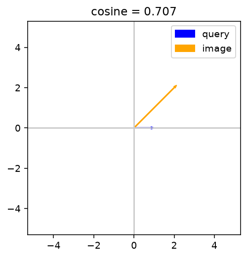
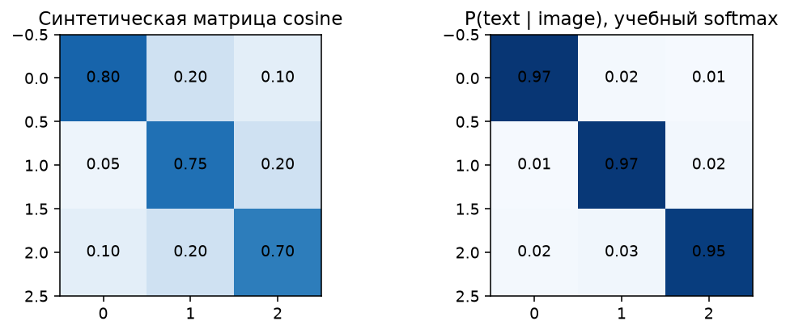

# 04 · Визуальные представления и поиск по тексту

Практикум к лекции 5: CLIP → поиск с отказом; Grounding DINO → рамки → SAM → маски.
**Две пары по 90 минут**, затем около 60–90 минут на оформление. Обучение больших сетей не требуется.

| Материал | Назначение |
|---|---|
| [01_interactive_demo.ipynb](01_interactive_demo.ipynb) | Семь стендов с теорией, прогнозом, параметрами, измерениями и трудными случаями |
| [02_retrieval_and_grounding.ipynb](02_retrieval_and_grounding.ipynb) | Пять TODO, открытые проверки, собственные примеры и два реальных эксперимента |
| [03_optional_experiments.ipynb](03_optional_experiments.ipynb) | Автономная дополнительная работа: язык, сжатие индекса или новые изображения |
| [ASSESSMENT.md](ASSESSMENT.md) | Формат сдачи и рубрика |
| [open_tests.py](open_tests.py) | Открытые проверки; тот же код встроен в основной notebook |
| [data_manifest.json](data_manifest.json), [model_manifest.json](model_manifest.json) | Источники, версии и SHA-256 |

## Что исследуем

1. Нормы, углы и cosine против скалярного произведения.
2. Контрастивная цель, температура, сильный негатив и неправильная пара.
3. Реальный CLIP: запрос, top-k, центральный crop, отсутствующий объект.
4. Зависимость softmax от словаря при неизменном cosine пары.
5. Hit@k, Recall@k, MRR и AP; несколько релевантных объектов и неоднозначная разметка.
6. Реальные Grounding DINO: порог рамок и порог токенов.
7. Реальный SAM: сдвиг/масштаб истинной рамки и отличие predicted quality от истинного mask IoU.

У каждого стенда нужны записи **прогноз → изменение → численное наблюдение → объяснение**.
Исходный опыт выполняется один раз при открытии стенда; повторные дорогие опыты запускаются кнопкой.
Стенд 6 сразу показывает панель управления, затем в её выводе сообщает о подготовке фотографии и модели.
При первом запуске проверяются файлы и загружается только Grounding DINO. Повторный запуск его ячейки
в том же ядре использует уже загруженную модель, если не менялись класс помощника и устройство. Изменение
только порогов для того же изображения и текста использует сохранённые logits; новый текст запускает модель.
SAM загружается при первой непустой подсказке в стенде 7. Новые рамки на той же фотографии используют
сохранённые признаки изображения SAM. Первое ожидание при открытии стенда связано с загрузкой модели;
время, которое печатает стенд 7, не включает эту однократную загрузку SAM.
Синтетические матрицы используются только для объяснения механизма и обозначены явно.

## Запуск

Откройте notebook локально в Jupyter либо загрузите **один файл** через «Загрузить блокнот» в Colab.
Весь исполняемый код встроен, соседние файлы и преподавательские решения не требуются.
До публикации блока проверенной GitHub/Colab-ссылки нет; не рассчитывайте на вымышленную удалённую ссылку.

Локально: создайте отдельное Python 3.11 окружение, установите [requirements.txt](requirements.txt), запустите Jupyter.
`start_demo.sh` открывает демо детекции; для этой работы выберите в файловой панели
`labs/04_visual_representations/01_interactive_demo.ipynb` и ядро с установленными зависимостями.
В Colab используйте закомментированную установочную ячейку при необходимости; после смены пакетов перезапустите ядро.
Если вы уже включили `%pip` в сохранённом ноутбуке, при следующих запусках пропускайте эту ячейку: повторная установка пакетов не нужна.
Официальные веса CLIP содержат `pytorch_model.bin`; проверяются фиксированная ревизия и SHA-256.
DINO и SAM используют safetensors. Не заменяйте источники весов случайными зеркалами.

Учебные численные стенды используют NumPy на CPU. Реальные CLIP, Grounding DINO и SAM автоматически
используют CUDA, если она доступна установленному PyTorch; выбранное устройство печатается при запуске
ячейки помощников. Если PyTorch не видит CUDA, модели работают на CPU. При наличии видеокарты и выборе CPU
проверьте `torch.cuda.is_available()`, драйвер и установку PyTorch с поддержкой CUDA для вашей системы;
после её изменения перезапустите ядро и выполните ноутбук сверху вниз.
При необходимости задайте `VISUAL_LAB_DEVICE=cpu` или `VISUAL_LAB_DEVICE=cuda` до запуска ячейки помощников.
Явный выбор `cuda` вызовет ошибку, если PyTorch не видит видеокарту.

CPU достаточно для выполнения лабораторной. Проверочный полный эксперимент на CPU, 4 потока Torch, занял около 4 минут без скачивания;
CLIP кодировал 8 изображений примерно за 1.2 с, DINO — 12–14 с/кадр, SAM — 20–22 с/кадр.
Это локальные ориентиры, не результаты бенчмарка и не гарантия для другой машины.
На NVIDIA GeForce GTX 1080 Ti с уже скачанными весами и данными контрольный запуск демо из обычного
пользовательского кэша занял 23,7 с, полный преподавательский эталон — 20,4 с; ошибок не было.
Это одиночные локальные прогоны, а не
гарантия времени для другой машины. После загрузки DINO изменение только порогов в контрольном опыте заняло
0,005 с, а новый текст — 0,435 с. Первый запуск для нового изображения SAM вычисляет его признаки заново.
Время полных прогонов включает запуск ноутбука, но не установку пакетов и не скачивание.
Нужно примерно 6–8 GB RAM и 4 GB свободного места: веса около 1.6 GiB, Penn–Fudan около 54 MB,
галерея — несколько MB. Видеокарта необязательна; объём её памяти также должен вмещать загруженные модели.
Время скачивания и загрузки весов не входит в измерение inference.

Данные и веса живут в `~/.cache/applied-ai-visual`; можно задать переменную `VISUAL_LAB_CACHE`.
Если `DETECTION_LAB_ROOT` указывает на уже скачанный архив Penn–Fudan с правильной SHA-256,
стенд использует его без повторного скачивания. При новой загрузке в выводе видны ход скачивания
и ошибка сети, если она произошла; сетевое чтение имеет таймаут 30 с на одну операцию,
но общее время скачивания этим не ограничено.
Результаты — в подкаталоге `results` этого кэша либо в `VISUAL_LAB_RESULTS`.
Не загружайте их в Git. При сетевой ошибке загрузка останавливается без подстановки фиктивных признаков.
Первый запуск незаполненной работы 02 останавливается на `NotImplementedError`: заполните TODO и собственные тесты.

## Протокол реальных опытов

**Поиск.** Восемь изображений, восемь val-запросов, восемь test-запросов с новым текстом и по четыре отсутствующих запроса.
Сравниваются буквальный запрос и ensemble трёх шаблонов; метод выбирается по val mAP, при равенстве — baseline.
Порог margin выбирается по balanced accuracy val; далее фиксируется до test. Crop 60% — отдельный опыт только на val.
Галерея неизменна: test проверяет устойчивость к формулировкам, **не качество на новых изображениях**.
Размер слишком мал для общего рейтинга моделей. Насыщение метрик — допустимый отрицательный результат опыта с шаблонами.

**Локализация.** Четыре заданных кадра Penn–Fudan, первые два val и последние два test.
`a person.`, box threshold=.30, text threshold=.25, matching IoU=.5 зафиксированы заранее.
Рамки оцениваются TP/FP/FN. Для масок отдельно считаются IoU matched-пар и среднее по всем GT с нулём за пропуск;
ложные рамки остаются в FP. Сравнение с SAM по истинной рамке диагностирует ошибку подсказки.
Это не оценка на полном Penn–Fudan и не доказательство способности находить unseen categories.

## Данные, права и источники

Галерея загружается из официального scikit-image v0.25.2, каждый файл проверяется по SHA-256.
Права описаны в [официальных функциях data](https://scikit-image.org/docs/0.25.x/api/skimage.data.html)
и [исходном коде v0.25.2](https://github.com/scikit-image/scikit-image/blob/v0.25.2/skimage/data/_fetchers.py).

| ID | Происхождение и права |
|---|---|
| astronaut | NASA, Eileen Collins; public domain |
| camera | Lav Varshney; CC0; новый снимок из scikit-image ≥0.18 |
| coffee | Rachel Michetti / Pikolo Espresso Bar; CC0 |
| chelsea | Stefan van der Walt; CC0 |
| rocket | SpaceX, запуск DSCOVR; public domain |
| coins | Brooklyn Museum; no known copyright restrictions |
| horse | Andreas Preuss (marauder); CC0; это силуэт, **не фотография** |
| hubble_deep_field | NASA Hubble eXtreme Deep Field; public domain |

[Penn–Fudan](https://www.cis.upenn.edu/~jshi/ped_html/) предоставлен авторами для исследовательской работы.
Загружается исходный архив с известным SHA-256; считываются только четыре изображения и их GT masks.
Архив и фотографии не входят в выдаваемый комплект. При публичном размещении удаляйте outputs с Penn–Fudan;
используйте их для личной сдачи и защиты с атрибуцией, не назначайте им новую лицензию.

Модели: [OpenAI CLIP](https://github.com/openai/CLIP) / MIT,
[Grounding DINO](https://github.com/IDEA-Research/GroundingDINO) / Apache-2.0,
[SAM](https://github.com/facebookresearch/segment-anything) / Apache-2.0.
Точные фиксированные checkpoints, ревизии и хэши — в model_manifest.json.
[Статья CLIP](https://proceedings.mlr.press/v139/radford21a.html),
[Grounding DINO](https://arxiv.org/abs/2303.05499),
[SAM](https://openaccess.thecvf.com/content/ICCV2023/html/Kirillov_Segment_Anything_ICCV_2023_paper.html).
CLIP здесь рассчитан на английский; русские запросы в дополнительной работе — исследовательский стресс-тест.
Авторским материалам курса отдельная лицензия владельцем пока не назначена.

## Соглашения оценщика

Cosine нулевого вектора математически не определён; код возвращает нулевую строку по учебному техническому соглашению.
Recall запроса без relevant также не определён; helper возвращает 0 для фиксированной формы массивов.
Основные retrieval-метрики усредняются только по положительным запросам с GT. Отсутствующие запросы оцениваются
отдельно как rejection/acceptance, поэтому технический ноль не смешивается с качеством поиска.
Сопоставление рамок — confidence-descending greedy matching при фиксированном IoU, а не оптимальное назначение;
для одного класса это проверяемый способ посчитать дубликаты/пропуски при выбранном пороге, не замена COCO AP.

## Статические учебные примеры

Иллюстрации показывают геометрию и придуманную матрицу контрастивного обучения; это не выходы обученной модели.
Они также встроены в markdown ноутбука 01, чтобы отдельный файл открывался без соседних данных.

